# Level 1 - C4 Context Diagram - System Context

**Description:** Shows Comersant Game Platform in the context of players and administrators. The system provides a web interface for multiplayer board game sessions in real-time.

```mermaid
graph TB
    %% Actors
    Player["👤 Game Player<br/>A person who wants to play<br/>Comersant board game online"]
    Admin["👨‍💼 System Administrator<br/>Manages the game platform<br/>and monitors system health"]
    
    %% Main System
    Comersant["🎮 Comersant Game Platform<br/>Monopoly-style multiplayer board game.<br/>Allows players to create game rooms,<br/>join multiplayer Comersant games,<br/>and play in real-time"]
    
    %% External Systems
    Browser["🌐 Web Browser<br/>Player's web browser<br/>for accessing the game"]
    Docs["📚 Documentation System<br/>Compodoc generated documentation<br/>for frontend and backend"]
    
    %% Relationships
    Player -->|"Uses<br/>HTTPS"| Browser
    Browser -->|"Plays games, creates rooms<br/>HTTPS/WebSocket"| Comersant
    Admin -->|"Views documentation<br/>HTTPS"| Docs
    Admin -->|"Monitors system<br/>HTTPS"| Comersant
    Comersant -->|"Serves documentation<br/>HTTP"| Docs
    
    %% Styling
    classDef person fill:#1168bd,stroke:#0b4884,stroke-width:2px,color:#ffffff
    classDef internalSystem fill:#1f77b4,stroke:#144870,stroke-width:2px,color:#ffffff
    classDef externalSystem fill:#999999,stroke:#6b6b6b,stroke-width:2px,color:#ffffff
    
    class Player,Admin person
    class Comersant internalSystem
    class Browser,Docs externalSystem
```

**Key Features:**
- **Real-time multiplayer** game platform
- **Room management** system  
- **Turn-based gameplay** mechanics
- **Property trading** functionality
- **Real-time synchronization** between players
- **WebSocket communication** for instant updates