# C4 Container Diagram - System Architecture

```mermaid
graph TB
    %% Actor
    Player["👤 Game Player"]
    
    %% External Systems
    Browser["🌐 Web Browser<br/>Player's web browser"]
    CompodocExt["📚 Compodoc Documentation<br/>Generated API documentation"]
    
    %% Main System Boundary
    subgraph "🎮 Comersant Game Platform"
        SPA["📱 Single Page Application<br/>Angular 16, TypeScript<br/>Provides game interface, lobby<br/>management, and real-time<br/>game board to players"]
        
        API["🔌 API Application<br/>NestJS, TypeScript<br/>Provides REST APIs for room<br/>management and serves<br/>static content"]
        
        WebSocket["⚡ WebSocket Server<br/>Socket.IO, NestJS<br/>Handles real-time communication<br/>for lobby events and game<br/>state synchronization"]
        
        GameEngine["🎯 Game Engine<br/>TypeScript Classes<br/>Manages game logic, player turns,<br/>property transactions,<br/>and board state"]
        
        StaticFiles["📁 Static File Server<br/>NestJS ServeStatic<br/>Serves documentation,<br/>compiled frontend,<br/>and static assets"]
    end
    
    %% Relationships
    Player -->|"Uses<br/>HTTPS"| Browser
    Browser -->|"Loads and interacts<br/>HTTPS"| SPA
    SPA -->|"Makes API calls<br/>HTTPS/JSON"| API
    SPA -->|"Real-time communication<br/>WebSocket"| WebSocket
    
    WebSocket -->|"Manages game state<br/>Method calls"| GameEngine
    API -->|"Room management<br/>Direct calls"| WebSocket
    StaticFiles -->|"Serves built app<br/>HTTP"| SPA
    StaticFiles -->|"Serves docs<br/>HTTP"| CompodocExt
    
    %% Styling
    classDef person fill:#1168bd,stroke:#0b4884,stroke-width:2px,color:#ffffff
    classDef externalSystem fill:#999999,stroke:#6b6b6b,stroke-width:2px,color:#ffffff
    classDef container fill:#438dd5,stroke:#2e6da4,stroke-width:2px,color:#ffffff
    
    class Player person
    class Browser,CompodocExt externalSystem
    class SPA,API,WebSocket,GameEngine,StaticFiles container
```

**Technology Stack:**
- **Frontend**: Angular 16, TypeScript, Socket.IO Client
- **Backend**: NestJS, Socket.IO Server, TypeScript
- **Communication**: HTTPS REST API, WebSocket real-time
- **Documentation**: Compodoc auto-generation

**Key Features:**
- **Angular Modules**: Lobby Module, Game Module, Shared Components
- **WebSocket Namespaces**: `/lobby` (room management), `/game` (gameplay events)
- **Game Engine**: Board management, Player mechanics, Property system, Turn processing