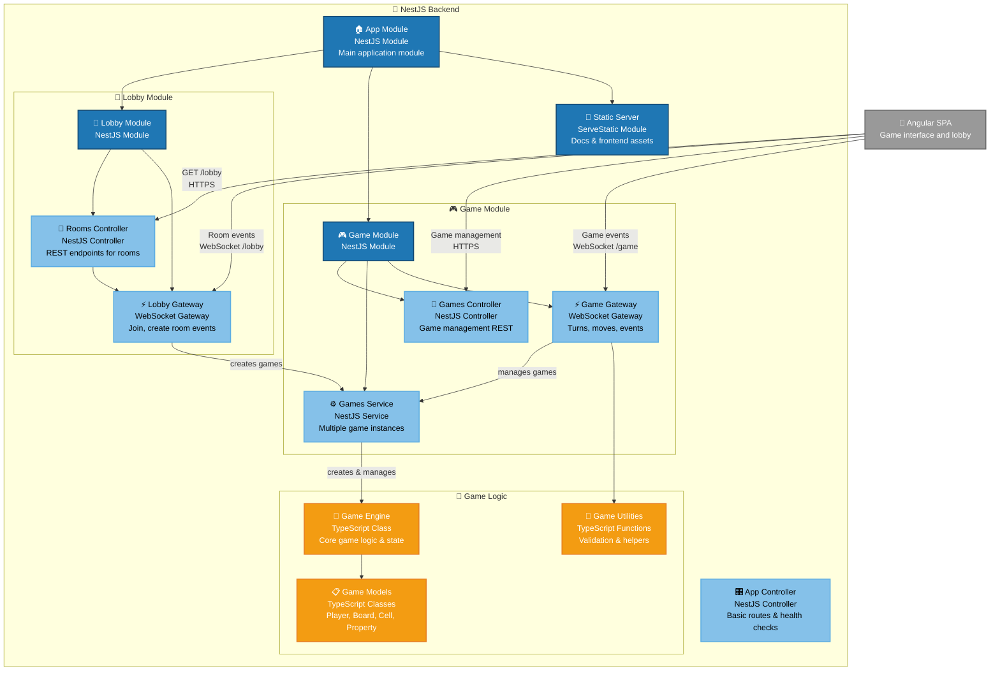

# C4 Component Diagram - Backend Architecture

**Core Game Mechanics:**
- **Turn management** with player validation
- **Property transactions** and ownership
- **Player movement** on game board
- **Event handling** for special cells

**Real-time Events:**
- `nextTurn` - Process player turn
- `buyProperty` - Handle property purchase
- `player_moved` - Sync player position