# C4 Component Diagram - Frontend Architecture

```mermaid
graph TB
    %% External
    Backend["🔧 NestJS Backend<br/>API & WebSocket<br/>Game logic and room management"]
    
    subgraph "📱 Angular Single Page Application"
        %% Root Level
        AppModule["🏠 App Module<br/>Angular Module<br/>Root module with routing"]
        AppComponent["🎯 App Component<br/>Angular Component<br/>Root component with router outlet"]
        AppRouting["🗺️ App Routing<br/>Angular Routing<br/>Main routes: /lobby, /game"]
        
        %% Lobby Module
        subgraph "🏢 Lobby Features"
            LobbyModule["🏢 Lobby Module<br/>Angular Module<br/>Lazy-loaded room management"]
            LobbyComponents["🧩 Lobby Components<br/>Angular Components<br/>Main, Room, SetName, etc."]
            LobbyService["⚡ Lobby Service<br/>Angular Service<br/>WebSocket /lobby namespace"]
            LobbyRouting["🗺️ Lobby Routing<br/>Angular Routing<br/>Routes: /, /:room"]
        end
        
        %% Game Module
        subgraph "🎮 Game Features"
            GameModule["🎮 Game Module<br/>Angular Module<br/>Lazy-loaded gameplay"]
            GameMainComponent["🎯 Game Main Component<br/>Angular Component<br/>Main game container"]
            GameBoardComponent["🎲 Game Board Component<br/>Angular Component<br/>Renders board and cells"]
            GameUIComponents["🎛️ Game UI Components<br/>Angular Components<br/>GameControl, PlayerInfo, PropertyPanel"]
            GameService["⚡ Game Service<br/>Angular Service<br/>WebSocket /game namespace"]
            GameStateService["💾 Game State Service<br/>Angular Service<br/>Local game state management"]
            GameEventsService["📡 Game Events Service<br/>Angular Service<br/>Game event coordination"]
            GameRouting["🗺️ Game Routing<br/>Angular Routing<br/>Route: /:gameId"]
        end
        
        %% Shared
        SharedServices["🔧 Shared Services<br/>Angular Services<br/>UserSettings, Translation, Utils"]
        SharedModels["📋 Shared Models<br/>TypeScript Interfaces<br/>Types from backend models"]
    end
    
    %% Relationships
    AppModule --> AppRouting
    AppModule --> LobbyModule
    AppModule --> GameModule
    AppComponent --> AppRouting
    
    LobbyModule --> LobbyComponents
    LobbyModule --> LobbyService
    LobbyModule --> LobbyRouting
    LobbyComponents --> LobbyService
    
    GameModule --> GameMainComponent
    GameModule --> GameBoardComponent
    GameModule --> GameUIComponents
    GameModule --> GameService
    GameModule --> GameStateService
    GameModule --> GameEventsService
    GameModule --> GameRouting
    
    GameMainComponent --> GameBoardComponent
    GameMainComponent --> GameUIComponents
    GameUIComponents --> GameService
    GameUIComponents --> GameStateService
    GameService --> GameEventsService
    
    LobbyService -->|"WebSocket /lobby"| Backend
    GameService -->|"WebSocket /game"| Backend
    SharedModels -->|"imports types"| Backend
    
    %% Styling
    classDef external fill:#999999,stroke:#6b6b6b,stroke-width:2px,color:#ffffff
    classDef module fill:#e74c3c,stroke:#c0392b,stroke-width:2px,color:#ffffff
    classDef component fill:#f1948a,stroke:#ec7063,stroke-width:2px,color:#000000
    classDef service fill:#3498db,stroke:#2980b9,stroke-width:2px,color:#ffffff
    classDef shared fill:#95a5a6,stroke:#7f8c8d,stroke-width:2px,color:#ffffff
    
    class Backend external
    class AppModule,LobbyModule,GameModule module
    class AppComponent,AppRouting,LobbyComponents,LobbyRouting,GameMainComponent,GameBoardComponent,GameUIComponents,GameRouting component
    class LobbyService,GameService,GameStateService,GameEventsService service
    class SharedServices,SharedModels shared
```

**Lobby Events:**
- `createRoom` - Create new game room
- `enterRoom` - Join existing room
- `startGame` - Begin game session
- `setName` - Set player name

**Game Events:**
- `nextTurn` - Process turn action
- `buyProperty` - Purchase property
- `handleGameState` - Sync game state

**Board Rendering:**
- **Board cells** with property states
- **Player pawns** with animations
- **Property states** (owned/unowned)
- **Cell interactions** (hover/click)