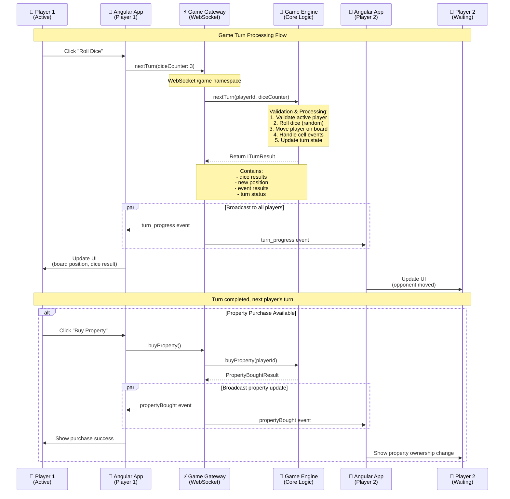

# Game Turn Flow - Sequence Diagram

**Key Events:**
- **nextTurn**: Core turn processing with dice roll and movement
- **buyProperty**: Property purchase transaction
- **turn_progress**: Real-time game state synchronization
- **propertyBought**: Property ownership updates

**Validation & Security:**
- Player validation through `@ValidateActivePlayer` decorator
- Game state managed centrally on server
- All clients receive synchronized updates